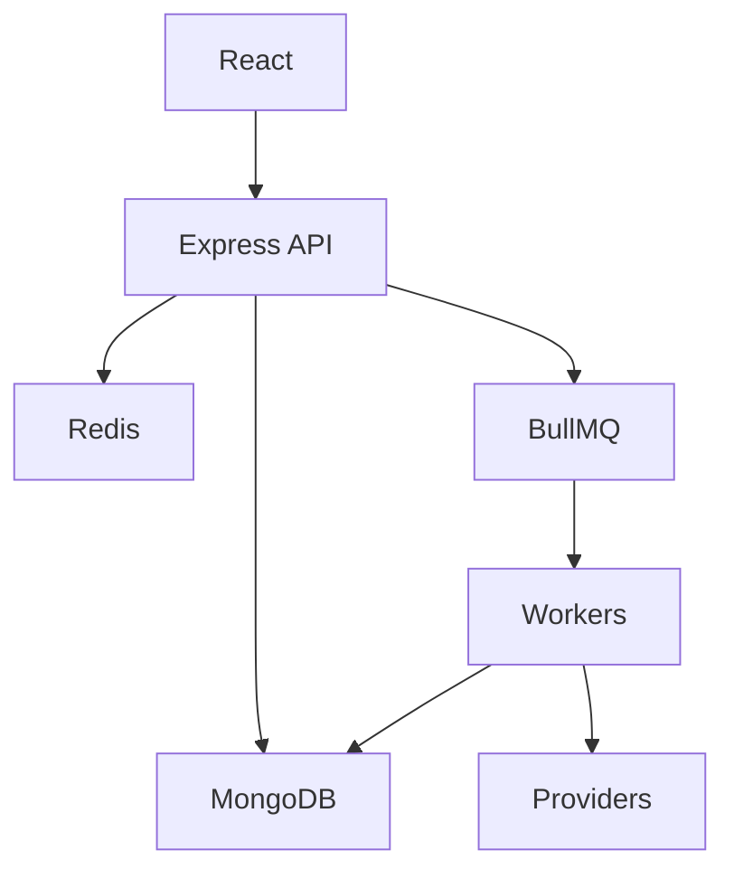

# Open Source Notification Platform

A production-style multi-channel notification platform built with Node.js, TypeScript, Express, MongoDB, Redis, BullMQ, and React.

## Features

- JWT auth with bcrypt, refresh tokens, roles, Helmet, CORS, validation, and rate limiting
- Templates with variable rendering and validation
- Workflows with ordered channel steps and delays
- Async notification processing through BullMQ workers
- Email, SMS, push, and in-app provider abstraction with mock providers and SMTP email adapter
- Scheduling, cancellation, retries, idempotency keys, delivery attempts, notification history, preferences, analytics, health checks, metrics, and Swagger UI
- React admin dashboard for templates, workflows, notifications, analytics, preferences, providers, and settings

## Setup

```bash
npm install
cp .env.example .env
npm run build
npm test
npm run seed
npm run dev
```

Run workers separately:

```bash
npm run worker
```

Docker:

```bash
docker compose up --build
```

API docs: `http://localhost:4000/api/docs`

Demo seed credentials: `admin@example.com / Password123` and `user@example.com / Password123`.

## Architecture



See `docs/` for architecture, queues, database, system-design, deployment, and API notes.
# Kafka1
