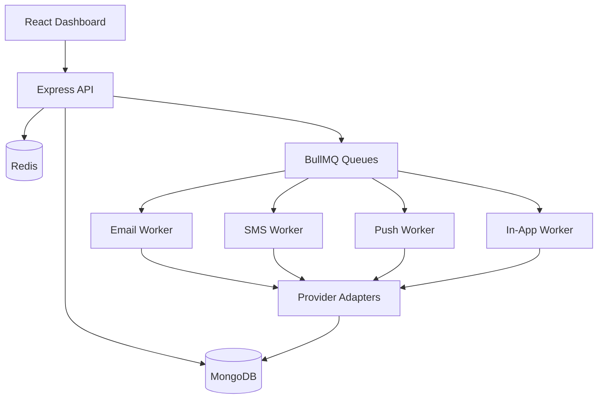

# Architecture

Controllers validate transport concerns, services perform business decisions, repositories and Mongoose models handle persistence, queues decouple slow providers from API requests, and workers write delivery attempts plus notification state transitions.
