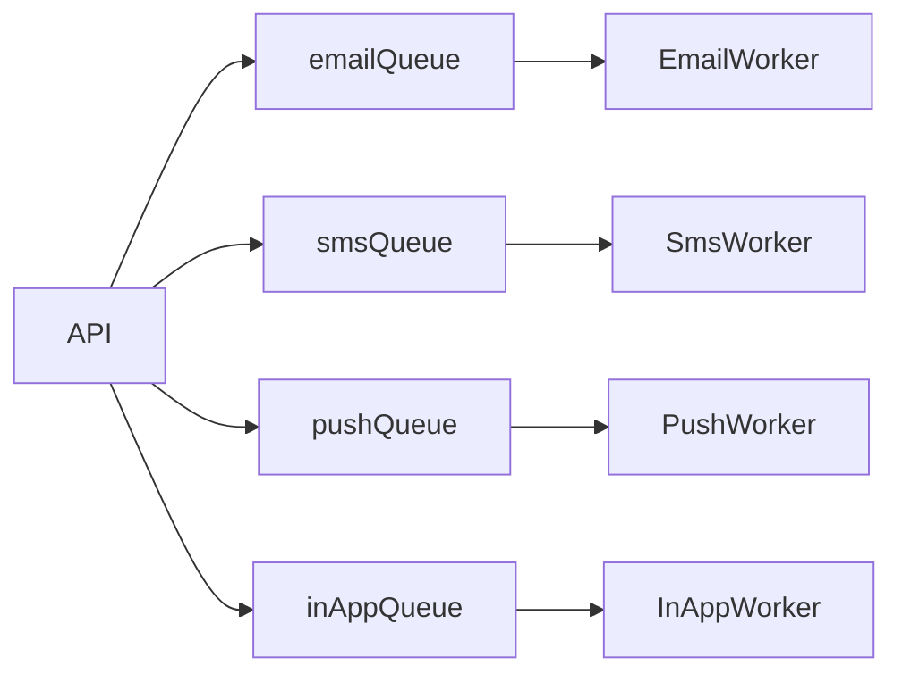

# Queues

BullMQ jobs use stable notification IDs, delayed scheduling, three attempts, and exponential backoff. Workers mark notifications `PROCESSING`, create `DeliveryAttempt` records, call a provider adapter, then update final status.
