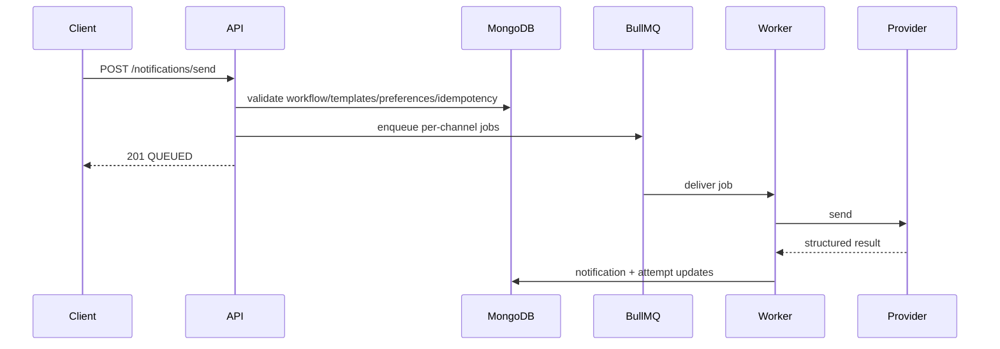

# System Design

Scalability comes from stateless API instances, independent workers per queue, Redis-backed queueing, MongoDB indexes, and pagination. Idempotency keys protect duplicate sends. Rate limiting protects API capacity. Scheduling is implemented with BullMQ delayed jobs and UTC timestamps.
